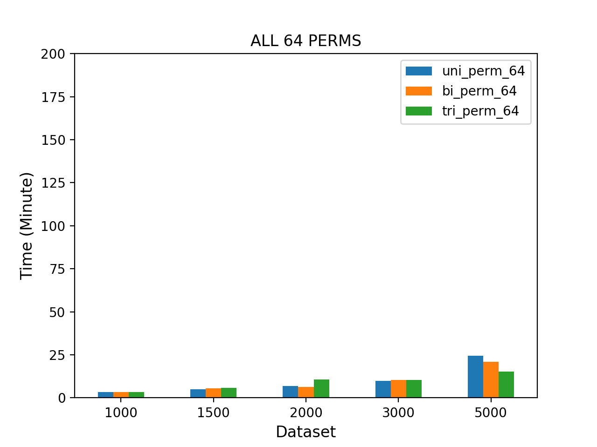
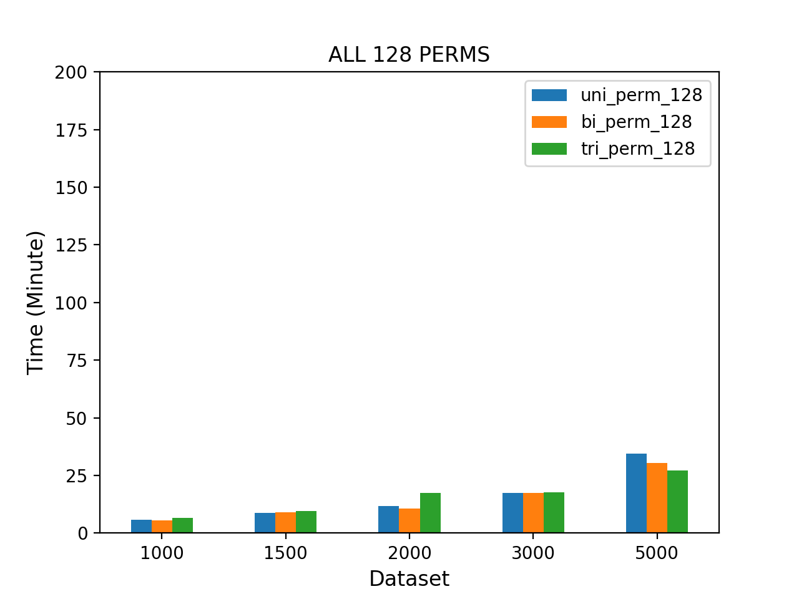
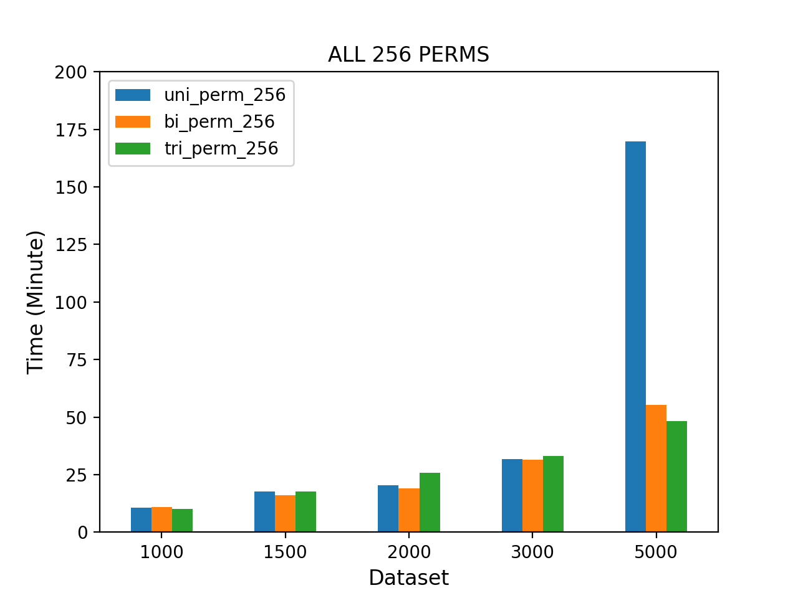
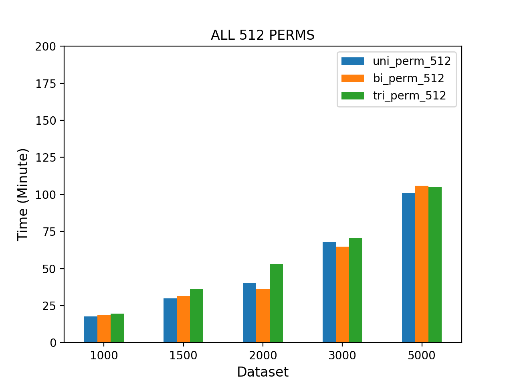
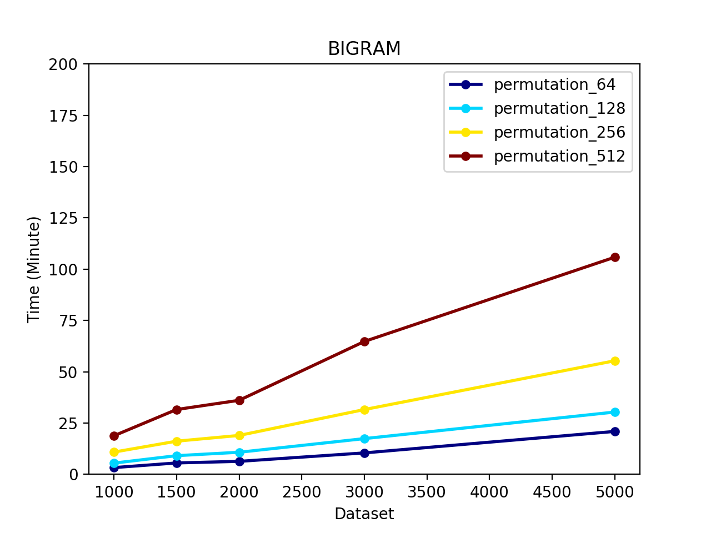
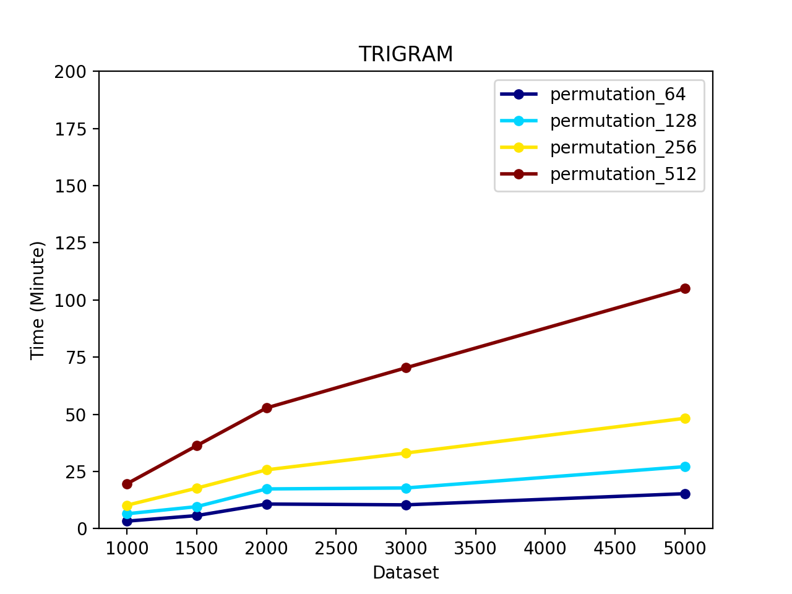

# bitLsh for Detecting TrendingTopic
Bit locality sensitive hashing is an unspervised machine learning algorithm that takes in some data and categorized them and then inturns detect trending topic.

The goal of using lsh is to group similar tweets to the same buckets, Candidate pairs are those that hash at least once to the same bucket.

### Steps Involve.
1. Setup a streaming scripts using twitter api to crawl live tweet from twitter and save them into a scv format.
2. Preprocess the datasets by removing stop words, stemming, lemmatization, normalization to lower case, remove punctuatuion,remove non-ascii characters, e.t.c and save the result in a dataframe.
3. Convert the resulting dataframe to a TF-IDF bags of words model.
4. Convert each word in the TF-IDF bag of words to minHash using these `[64, 128, 256, 512]` permutation which tries to find a collision to determine how similar those words are.
5. Load the result of the minHash algorithm to a LocalitySensitive Hashing algorithm that divides the result into bands and row.
6. Get most buckets with results.
7. Pass the filtered result to a DBSCAN clustering algorithm and group accordingly.

### Clone Repository
1. Clone the repository by running `git clone https://github.com/princesegzy01/bitLsh-TrendingTopic.git`
2. run `python lsHash.py`

### Result

     

     

     

     

     
  
      
    